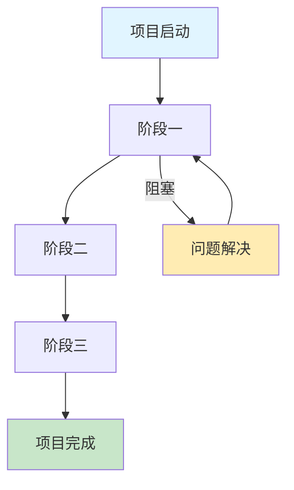
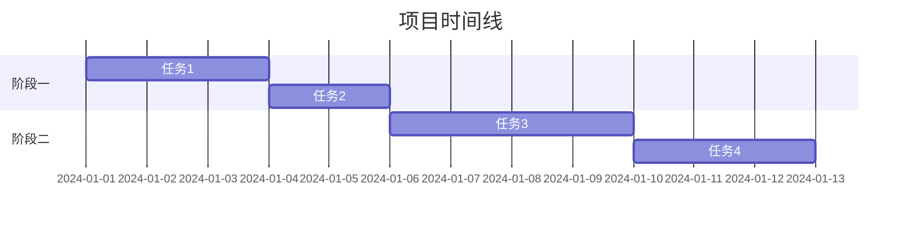
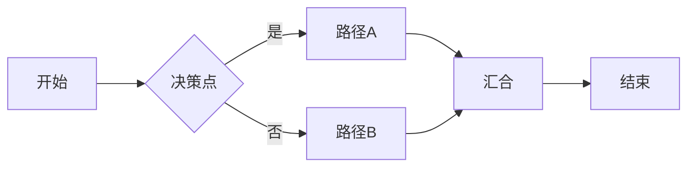
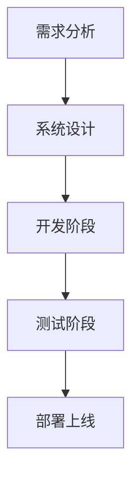

# 计划生成技能 (Plan Creation Skill)

## 技能目标
指导AI生成结构清晰、美观专业、高度可执行的计划文档。

## 计划质量标准

### 核心原则
1. **结构化层次** - 使用清晰的层级关系，避免扁平堆砌
2. **可执行性** - 每个步骤都应该是具体的、可操作的
3. **视觉吸引力** - 使用格式化增强可读性
4. **逻辑连贯** - 任务之间有清晰的依赖和递进关系
5. **完整性** - 包含所有必要的信息（时间、资源、依赖、风险）

### 计划结构模板

```
# 📋 [项目名称] 执行计划

## 🎯 项目目标
- 核心目标（1-2句话）
- 关键成果（3-5个要点）

## 📊 项目概览
- **总预计时间**: [时间范围]
- **主要阶段**: [阶段数量]个
- **关键依赖**: [列出主要依赖项]
- **风险等级**: [低/中/高]

## 🔄 执行路线图
[可选：Mermaid流程图]

## 📅 详细执行计划

### 阶段一：[阶段名称] ⏱️ [预计时间]
**🎯 阶段目标**: [本阶段要达成什么]

**📋 任务清单**
| 序号 | 任务 | 优先级 | 预计时长 | 依赖 | 状态 |
|------|------|--------|----------|------|------|
| 1 | [具体任务描述] | 🔴高/🟡中/🟢低 | [时间] | [前置任务] | ⬜ |
| 2 | [具体任务描述] | 🔴高/🟡中/🟢低 | [时间] | [前置任务] | ⬜ |

**🎨 交付物**
- [ ] [交付物1]
- [ ] [交付物2]

**⚠️ 风险与应对**
| 风险 | 可能性 | 影响 | 应对策略 |
|------|--------|------|----------|
| [风险描述] | 高/中/低 | 高/中/低 | [应对措施] |

---

### 阶段二：[阶段名称] ⏱️ [预计时间]
[重复上述结构...]

## 📈 进度追踪

### 当前状态
- ✅ 已完成: [数量]个任务
- 🔄 进行中: [数量]个任务  
- ⏳ 待开始: [数量]个任务
- ❌ 已阻塞: [数量]个任务

### 里程碑
| 里程碑 | 预期时间 | 实际时间 | 状态 |
|--------|----------|----------|------|
| [里程碑1] | [日期] | [日期] | ✅/🔄/⏳/❌ |

## 🛠️ 所需资源

### 人力资源
| 角色 | 数量 | 投入时间 | 职责 |
|------|------|----------|------|
| [角色1] | [数量] | [时间] | [职责] |

### 技术资源
- [ ] [资源1]
- [ ] [资源2]

## 📝 备注
[其他重要信息]

## 🔄 版本历史
| 版本 | 日期 | 变更说明 | 修改人 |
|------|------|----------|--------|
| v1.0 | [日期] | 初始版本 | [AI] |
```

## 🎨 格式化最佳实践

### 1. 使用Emoji增强视觉效果
- ✅ 表示完成
- ⬜ 表示待办
- 🔄 表示进行中
- ❌ 表示阻塞或失败
- ⏳ 表示等待中
- 🎯 表示目标
- 📋 表示任务
- ⚠️ 表示警告
- 🎨 表示交付物
- 📊 表示数据/统计
- 📅 表示时间/计划
- 🔴🟡🟢 表示优先级（高/中/低）

### 2. 使用表格呈现结构化数据
- 任务清单（序号、任务、优先级、时间、依赖、状态）
- 风险矩阵（风险、可能性、影响、应对）
- 进度追踪（里程碑、预期、实际、状态）
- 资源清单（角色、数量、投入、职责）

### 3. 使用代码块展示具体指令
```bash
# 具体命令示例
npm install
npm run build
```

```python
# 代码示例
def example():
    pass
```

### 4. 使用引用块强调重要内容
> ⚠️ **注意**: 这是关键注意事项

> 💡 **提示**: 这是优化建议

### 5. 使用分割线分隔主要章节
---

### 6. 使用折叠区域组织详细内容（如果支持）
<details>
<summary>查看详细说明</summary>

详细内容...
</details>

## 📊 Mermaid流程图模板







## 🎯 任务描述规范

### 好的任务描述
✅ "实现用户登录功能，包括表单验证和错误处理"

❌ "做登录"

### 任务描述要素
1. **动作动词开头** - "实现"、"设计"、"测试"、"部署"
2. **明确范围** - 说明包含什么，不包含什么
3. **可量化结果** - 能够判断何时完成
4. **具体可操作** - 不需要再解释就知道怎么做

## 📈 优先级设定原则

### 🔴 高优先级 (P0)
- 阻塞其他任务的
- 核心功能路径
- 影响项目整体进度的

### 🟡 中优先级 (P1)
- 重要但非阻塞的
- 优化性质的
- 可以并行进行的

### 🟢 低优先级 (P2)
- 锦上添花的
- 可以延后的
- 不影响核心功能的

## ⚠️ 风险管理

### 风险矩阵应用
| 可能性\影响 | 低 | 中 | 高 |
|-----------|---|---|---|
| 高 | 🟡 | 🔴 | 🔴 |
| 中 | 🟢 | 🟡 | 🔴 |
| 低 | 🟢 | 🟢 | 🟡 |

### 风险分类
1. **技术风险** - 技术方案可行性、依赖项问题
2. **时间风险** - 估算偏差、意外延迟
3. **资源风险** - 人力不足、工具缺失
4. **依赖风险** - 外部服务、第三方API
5. **质量风险** - 测试覆盖、bug修复

## 📝 使用指南

### 何时使用此技能
- 需要创建项目执行计划时
- 需要拆解复杂任务时
- 需要向他人展示计划时
- 需要追踪项目进度时

### 使用步骤
1. 明确项目目标和范围
2. 识别主要阶段和里程碑
3. 拆解每个阶段的具体任务
4. 评估任务依赖关系和优先级
5. 估算时间和资源需求
6. 识别潜在风险并制定应对策略
7. 按照模板格式化输出
8. 如有流程图工具，生成可视化图表

### 动态更新
- 定期更新任务状态
- 记录实际完成时间
- 调整后续计划
- 更新风险状态

## 🌟 优秀计划示例

```
# 📋 电商网站开发执行计划

## 🎯 项目目标
构建一个功能完整的电商网站，支持用户注册、商品浏览、购物车、订单管理和支付功能。

## 📊 项目概览
- **总预计时间**: 6周
- **主要阶段**: 5个
- **关键依赖**: UI设计稿、支付API文档
- **风险等级**: 中

## 🔄 执行路线图



## 📅 详细执行计划

### 阶段一：需求分析与设计 ⏱️ 1周
**🎯 阶段目标**: 完成需求文档和系统设计

**📋 任务清单**
| 序号 | 任务 | 优先级 | 预计时长 | 依赖 | 状态 |
|------|------|--------|----------|------|------|
| 1 | 收集并整理业务需求 | 🔴高 | 2天 | - | ⬜ |
| 2 | 编写需求规格说明书 | 🔴高 | 1天 | 任务1 | ⬜ |
| 3 | 设计数据库Schema | 🔴高 | 2天 | 任务2 | ⬜ |
| 4 | 设计API接口文档 | 🟡中 | 1天 | 任务3 | ⬜ |

**🎨 交付物**
- [ ] 需求规格说明书
- [ ] 数据库设计文档
- [ ] API接口文档

**⚠️ 风险与应对**
| 风险 | 可能性 | 影响 | 应对策略 |
|------|--------|------|----------|
| 需求变更频繁 | 中 | 高 | 建立变更评审机制 |

---

### 阶段二：基础架构搭建 ⏱️ 1周
**🎯 阶段目标**: 搭建开发环境和基础框架

**📋 任务清单**
| 序号 | 任务 | 优先级 | 预计时长 | 依赖 | 状态 |
|------|------|--------|----------|------|------|
| 1 | 搭建前端项目架构 | 🔴高 | 2天 | 阶段一 | ⬜ |
| 2 | 搭建后端项目架构 | 🔴高 | 2天 | 阶段一 | ⬜ |
| 3 | 配置开发环境 | 🟡中 | 1天 | 任务1,2 | ⬜ |

**🎨 交付物**
- [ ] 前端项目骨架
- [ ] 后端项目骨架
- [ ] 开发环境配置文档

---

[后续阶段...]

## 📈 进度追踪

### 当前状态
- ✅ 已完成: 0个任务
- 🔄 进行中: 0个任务
- ⏳ 待开始: 15个任务
- ❌ 已阻塞: 0个任务

### 里程碑
| 里程碑 | 预期时间 | 实际时间 | 状态 |
|--------|----------|----------|------|
| 需求冻结 | 第1周末 | - | ⏳ |
| 开发完成 | 第5周末 | - | ⏳ |
| 上线发布 | 第6周末 | - | ⏳ |

## 🛠️ 所需资源

### 人力资源
| 角色 | 数量 | 投入时间 | 职责 |
|------|------|----------|------|
| 前端开发 | 1人 | 6周 | 前端开发 |
| 后端开发 | 1人 | 6周 | 后端开发 |
| 测试工程师 | 1人 | 4周 | 测试 |

### 技术资源
- [ ] 开发服务器
- [ ] 测试环境
- [ ] 版本控制仓库

## 🔄 版本历史
| 版本 | 日期 | 变更说明 | 修改人 |
|------|------|----------|--------|
| v1.0 | 2024-01-14 | 初始版本 | AI |
```

## 💡 高级技巧

### 1. 智能任务拆解
- 将大任务拆解为1-3天可完成的子任务
- 每个任务都有明确的开始和结束标准
- 考虑任务的独立性以便并行执行

### 2. 依赖关系可视化
- 使用Mermaid图清晰展示任务依赖
- 识别关键路径
- 找出可并行的任务

### 3. 灵活性设计
- 为每阶段预留10-20%缓冲时间
- 设置可调整的任务池
- 准备应急方案

### 4. 沟通友好
- 使用业务语言而非技术术语（面向非技术人员）
- 为每个阶段准备简短的进度摘要
- 突出显示需要决策的点

## ⚠️ 常见错误

### ❌ 避免
1. **任务过于笼统** - "优化性能"（太模糊）
2. **缺少时间估算** - 没有时间就无法管理进度
3. **忽视风险** - 不考虑可能出问题的地方
4. **格式混乱** - 一大段文字难以阅读
5. **缺少依赖关系** - 不知道任务的先后顺序

### ✅ 应该
1. **具体可测量** - "将页面加载时间从3秒优化到1.5秒"
2. **合理估算** - 基于历史数据或参考
3. **风险预案** - 识别风险并准备应对
4. **清晰格式** - 使用模板和结构化呈现
5. **明确依赖** - 清楚标注任务的前置条件

---

## 技能总结
本技能提供了生成高质量、美观专业、高度可执行计划的完整框架。通过遵循结构化模板、视觉化呈现、风险管理等原则，可以让计划更加清晰、专业、易读，提高执行效率和成功率。
